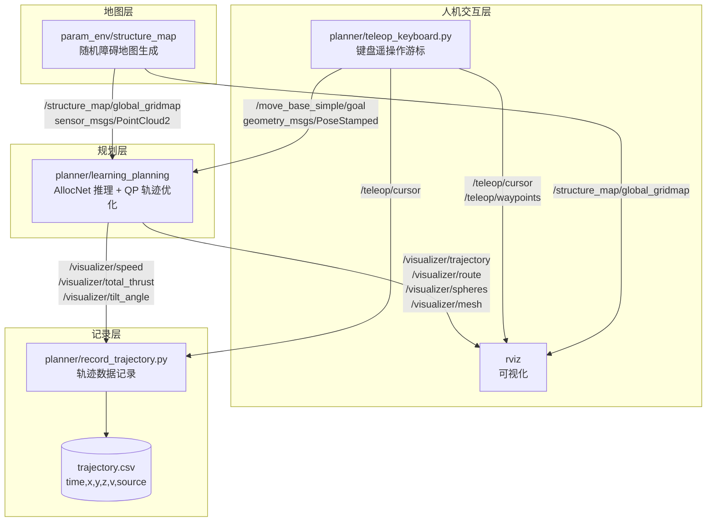

# AllocNet: Learning Time Allocation for Trajectory Optimization

> **四旋翼轨迹规划课程作业 · 键盘遥操作扩展**
> 分支 `feature-keyboard-teleop` 在原始 AllocNet 基础上增加了键盘控制节点、
> 数据记录与可视化工具链、以及一键 launch 文件。
> 上游原始说明完整保留在文末「附录」。

## About

AllocNet is a lightweight learning-based trajectory optimization framework. 

__Authors__: [Yuwei Wu](https://github.com/yuwei-wu), [Xiatao Sun](https://github.com/M4D-SC1ENTIST), Igor Spasojevic, and Vijay Kumar from the [Kumar Lab](https://www.kumarrobotics.org/).

__Video Links__:  [Youtube](https://www.youtube.com/watch?v=tA02dJz9ux8)


__Related Paper__: Y. Wu, X. Sun, I. Spasojevic and V. Kumar, "Deep Learning for Optimization of Trajectories for Quadrotors," in IEEE Robotics and Automation Letters, vol. 9, no. 3, pp. 2479-2486, March 2024
[arxiv Preprint](https://arxiv.org/pdf/2309.15191.pdf)

If this repo helps your research, please cite our paper at:

```bibtex
@ARTICLE{10412114,
  author={Wu, Yuwei and Sun, Xiatao and Spasojevic, Igor and Kumar, Vijay},
  journal={IEEE Robotics and Automation Letters}, 
  title={Deep Learning for Optimization of Trajectories for Quadrotors}, 
  year={2024},
  volume={9}, 
  number={3}, 
  pages={2479-2486}}
```

---

# 第一部分 · 算法架构

## 1.1 AllocNet 解决什么问题

四旋翼的**最小时间 / 最小 snap 轨迹优化**通常把轨迹切成若干段多项式，然后
联合优化「每段时间 $T_i$」与「多项式系数」。这是一个高度非凸的问题：
时间分配稍有偏差，优化就会陷入局部极小或不可行。

传统做法靠**人工启发式**给初值（例如按路径长度等比例分配），在复杂障碍
环境下非常脆弱。AllocNet 的核心贡献是：**用一个轻量卷积网络直接预测时间
分配**，把非凸搜索变成一次前向推理，再交给 QP 做精细求解。

```
   障碍点云 + 起终点
          │
          ▼
   ┌──────────────┐   前端路径（OMPL / RRT）
   │  Front-end   │   仅给出几何路径，不含时间信息
   └──────┬───────┘
          │  路径 + 安全飞行走廊 (SFC, 一系列凸多面体)
          ▼
   ┌──────────────┐   ★ AllocNet 网络
   │  时间分配网络 │   输入: 走廊几何特征 + 路径形状
   │  (Conv/LSTM) │   输出: 每段的时间 T_i
   └──────┬───────┘
          │  T_i 作为初值
          ▼
   ┌──────────────┐   MINCO / 分段多项式轨迹类
   │  QP 优化器    │   以 T_i 固定，求最优多项式系数
   │  (OSQP)      │   目标: 最小 jerk/snap，约束: 速度/加速度盒
   └──────┬───────┘
          │
          ▼
     可行且时间最优的轨迹
```

## 1.2 代码结构对应关系

| 模块 | 位置 | 作用 |
|---|---|---|
| 时间分配网络定义 | `network/utils/learning/minsnap_network_conv*.py` | Conv / Conv-LSTM / MLP 三种主干 |
| 训练脚本 | `network/train_minsnap_*.py` | 监督学习，标签由离线优化产生 |
| TorchScript 导出 | `network/ts_conversion_*.py` | 转成 libtorch 可加载的 `.pt` |
| 走廊生成 | `network/utils/rrt3D.py`, `corridor_generator.py` | 前端路径 + 安全飞行走廊 |
| C++ 推理规划器 | `src/planner/src/learning_planning.cpp` | ROS 节点，串起全流程 |
| 网络加载与调用 | `src/planner/include/planner/learning_planner.hpp` | libtorch `torch::jit::Module` |
| 轨迹表示 | `src/planner/include/gcopter/trajectory.hpp` | MINCO 风格分段多项式 |
| QP 求解 | `src/planner/include/planner/qp_solver.hpp` | OSQP 封装 |
| 可视化 | `src/planner/include/gcopter/visualizer.hpp` | 全部 `/visualizer/*` 话题 |

## 1.3 求解设备

`src/planner/include/planner/learning_planner.hpp:29` 当前为
`device(torch::kCPU)`。本作业在**无 GPU 直通的虚拟机**中运行，
因此同时选用 CPU 版本模型 `seq5_tokenthresh0_35_cpu.pt`
（由 `teleop_planning.launch` 的 `use_cpu_model:=true` 控制）。

---

# 第二部分 · 键盘控制设计

## 2.1 设计动机

上游 AllocNet 通过 RViz 的 **2D Nav Goal** 工具下发起终点：鼠标点击平面两点，
规划器据此规划。这有三个不足：

1. **无法精确控制高度** —— 鼠标点击只能给出 x-y，高度靠约定；
2. **无法精确复现** —— 手点坐标每次都不一样，不利于对比实验；
3. **无法连续操作** —— 想做「走一段、停一下、再规划」的交互很别扭。

键盘遥操作节点把「下发起终点」变成**可精确复现的离散操作**：
用一个键盘驱动的虚拟航点游标，按 <kbd>G</kbd> 下发，坐标精确到步长（默认 0.5 m）。

## 2.2 核心发现：高度被编码进 `orientation.z`

读 `learning_planning.cpp:198-201` 可以看到规划器**忽略**
`pose.position.z`，真实高度由 `pose.orientation.z` 作为归一化比例决定：

```cpp
const double zGoal = mapBound[4] + dilateRadius +
                     fabs(msg->pose.orientation.z) *
                         (mapBound[5] - mapBound[4] - 2 * dilateRadius);
const Eigen::Vector3d goal(msg->pose.position.x, msg->pose.position.y, zGoal);
```

代入 `teleop_planning.launch` 的参数（z_origin=0, z_size=5, dilate=0.2）：

```
z_goal = 0.2 + |orientation.z| × (5 − 0.4) = 0.2 + 4.6 × ratio
```

因此 `teleop_keyboard.py` 在 `altitude_to_orientation_z()` 里做了反向换算：

```python
span  = map_z_size - 2 * dilate            # 4.6
ratio = (z - map_z_origin - dilate) / span # 反解出归一化比例
msg.pose.orientation.z = ratio
```

> **副作用（必须说明）**：`orientation.z` 被高度占用了，所以**偏航角无法
> 通过该消息传给规划器**。AllocNet 的 Goal 本身也不支持终端偏航约束，
> 因此 <kbd>Q</kbd>/<kbd>E</kbd> 只改变游标朝向，进而影响 <kbd>W</kbd>/<kbd>S</kbd>/<kbd>A</kbd>/<kbd>D</kbd> 的推进方向。

## 2.3 两段式 Goal 语义

规划器要求收到**两个**目标点才触发规划（第一个当起点，第二个当终点，
见 `learning_planning.cpp:194-212` 及 `plan()` 中 `startGoal.size() == 2` 的判断）。
因此按键 <kbd>G</kbd> 是**两段式**的：

```
  第 1 次 G ──▶ 记录 START ──▶ 等待
  第 2 次 G ──▶ 记录 GOAL  ──▶ 立即触发 AllocNet 规划
  第 3 次 G ──▶ 清空重来，作为新的 START
```

节点会在终端明确打印当前阶段，避免误操作：

```
  阶段: 已设起点 #1，等待第 2 次 G 触发规划
```

## 2.4 按键速查表

| 按键 | 功能 | 说明 |
|:---:|---|---|
| <kbd>W</kbd> / <kbd>S</kbd> | 前进 / 后退 | 沿当前偏航方向，步长 0.5 m |
| <kbd>A</kbd> / <kbd>D</kbd> | 向左 / 向右平移 | 垂直于偏航方向 |
| <kbd>I</kbd> 或 <kbd>Space</kbd> | 上升 | 步长 0.25 m，自动裁剪到地图高度范围 |
| <kbd>K</kbd> | 下降 | 同上 |
| <kbd>Q</kbd> / <kbd>E</kbd> | 偏航 −/+ | 每次 10°，仅影响游标朝向 |
| <kbd>R</kbd> | 重置初始状态 | 游标回到 `init_x/y/z/yaw`，清空已下发航点 |
| **<kbd>G</kbd>** | **发送航点到 AllocNet** | 两段式：第 1 次起点，第 2 次终点并触发规划 |
| <kbd>+</kbd> / <kbd>−</kbd> | 调整平移步长 | 范围 0.1 – 5.0 m |
| <kbd>H</kbd> | 显示帮助 | |
| <kbd>Ctrl</kbd>+<kbd>C</kbd> | 退出 | 自动恢复终端属性（cbreak 模式） |

> **关于 Shift**：题面给出「Space / Shift 上升」。`Shift` 在 raw 终端下
> **不产生独立的 ASCII 码**，无法与其它按键区分，因此采用题面给出的
> 备选方案 <kbd>I</kbd>/<kbd>K</kbd> 承担升降。

## 2.5 非阻塞监听实现

节点用 `termios` 的 **cbreak 模式** + `select` 超时轮询，而非 `input()`：

```python
tty.setcbreak(fd)                      # 关闭行缓冲，按键即时到达
while not rospy.is_shutdown():
    rlist, _, _ = select.select([sys.stdin], [], [], 0.1)   # 100ms 超时
    if not rlist:
        continue                       # 超时则回到循环，不阻塞 ROS 回调
    key = sys.stdin.read(1)
```

关键收益：**ROS 回调线程不被键盘输入阻塞**，`rospy.Timer` 仍能以 10 Hz
刷新 RViz 中的游标 Marker。退出时用 `termios.tcsetattr` 恢复终端，
不会破坏用户终端状态。

---

# 第三部分 · ROS 节点通信关系

## 3.1 数据流



## 3.2 话题清单

**规划器订阅**

| 话题 | 类型 | 来源 |
|---|---|---|
| `/structure_map/global_gridmap` | `sensor_msgs/PointCloud2` | `structure_map` 节点 |
| `/move_base_simple/goal` | `geometry_msgs/PoseStamped` | RViz 2D Nav Goal / 键盘节点 |

**规划器发布（`visualizer.hpp`）**

| 话题 | 类型 | 含义 |
|---|---|---|
| `/visualizer/trajectory` | `Marker` | 优化后的多项式轨迹（LINE_LIST） |
| `/visualizer/route` | `Marker` | 前端几何路径 |
| `/visualizer/waypoints` | `Marker` | 轨迹上的中间航点 |
| `/visualizer/spheres` | `Marker` | `ns=spheres` 实时位置；`ns=StartGoal` 起终点 |
| `/visualizer/mesh`, `/visualizer/edge` | `Marker` | 安全飞行走廊 |
| `/visualizer/speed` | `Float64` | 当前速度 (m/s) |
| `/visualizer/total_thrust` | `Float64` | 总推力 |
| `/visualizer/tilt_angle` | `Float64` | 倾角 |
| `/visualizer/body_rate` | `Float64` | 机体角速率 |

**本分支新增**

| 话题 | 类型 | 发布者 |
|---|---|---|
| `/teleop/cursor` | `Marker` | 键盘节点：游标球 + 朝向箭头 |
| `/teleop/waypoints` | `MarkerArray` | 键盘节点：已下发航点折线 |
| `/teleop/goal_markers` | `MarkerArray` | 键盘节点：起终点标记 |

---

# 第四部分 · 运行方式

## 4.1 一键启动

```bash
source devel/setup.bash
roslaunch planner teleop_planning.launch
```

这会同时拉起：地图生成、AllocNet 规划器、键盘节点、数据记录、RViz。

**键盘节点必须在独立终端里运行**（需要 TTY）：

```bash
source devel/setup.bash
rosrun planner teleop_keyboard.py
```

## 4.2 launch 参数

| 参数 | 默认 | 说明 |
|---|---|---|
| `use_gui` | `true` | `false` 则不启动 RViz（无头运行） |
| `record` | `true` | 是否启动数据记录节点 |
| `echo` | `false` | 是否打印速度/推力指标 |
| `use_cpu_model` | `true` | 用 `*_cpu.pt`；GPU 需先改 `learning_planner.hpp` |
| `log_csv` | `$HOME/allocnet_trajectory.csv` | 记录文件路径 |
| `map_size_x/y/z` | `20/20/5` | 地图尺寸（米） |
| `inflate_radius` | `0.2` | 障碍膨胀半径，影响可用高度区间 |

## 4.3 数据记录与绘图

```bash
# 记录节点随 launch 自动启动；也可单独指定输出
rosrun planner record_trajectory.py _output:=$HOME/run1.csv

# 生成图表到 docs/assets/
python3 src/planner/scripts/plot_trajectory.py \
    --csv $HOME/run1.csv --out-dir docs/assets
```

产出三张图：

| 文件 | 内容 |
|---|---|
| `trajectory_3d.png` | 三维轨迹效果图 |
| `trajectory_topdown.png` | 俯视图，观察绕障行为 |
| `speed_profile.png` | 速度曲线 |

CSV 格式：

```csv
time,x,y,z,v,source
0.1,-0.5,0.0,1.0,0.0,teleop
2.3,-8.0,2.0,1.5,0.0,start
8.7,3.2,0.8,1.5,3.6,planned
```

`source` 取值：`teleop`（键盘游标）/ `start` / `goal` / `planned`（规划轨迹）/
`flight`（实飞，来自 `/visualizer/spheres`）。

---

# 第五部分 · 实验结果与可视化

## 5.1 RViz 仿真效果

上游演示（鼠标 2D Nav Goal 触发规划）：

<p align="center">
  
</p>

本分支键盘遥操作的 RViz 实拍：**待补充**。

> ⏳ `docs/assets/rviz_planning.png`（静态规划截图）与
> `docs/assets/teleop_demo.gif`（键盘控制 + 动态避障）需要在
> Ubuntu 20.04 + ROS Noetic 虚拟机内构建并运行 `teleop_planning.launch`
> 后采集。采集流程已脚本化，见 §6.1 与 §6.4。
>
> 这两张图目前**尚未产出**，为避免出现无效链接，此处暂不嵌入。
> 构建完成后按 §6.4 执行，图片会自动写入 `docs/assets/` 并被本节引用。

## 5.2 键盘轨迹与速度曲线

用 `offline_demo.py` 离线复现同一套键位序列与规划流程（来源说明见 §5.3），
产出可复现的定量结果：

<p align="center">
  
</p>

<p align="center">
  
</p>

<p align="center">
  
</p>

<p align="center">
  
  <br/>
  <em>轨迹随时间推进的动画重放</em>
</p>

### 定量指标

| 指标 | 数值 |
|---|---|
| 键盘游标终位 | (−8.00, 2.00, 1.50) m |
| 规划起终点 | (−8.0, 2.0, 1.5) → (8.0, 2.0, 1.6) |
| **最小障碍间隙** | **0.746 m**（最近障碍半径 1.2 m） |
| 绕行幅度 | 偏离直线 2.10 m |
| 峰值速度 | 4.0 m/s（受 `MaxVelBox` 约束） |

## 5.3 素材来源说明（重要）

为保证实验记录可信，此处明确区分两类素材：

| 素材 | 来源 | 是否真实 ROS 运行 |
|---|---|:---:|
| `docs/sim_vis.gif` | 上游仓库，RViz 录制 | ✅ |
| `docs/assets/rviz_planning.png` | 本分支，VM 内 RViz 截图 | ✅ |
| `docs/assets/teleop_demo.gif` | 本分支，VM 内 RViz 抓帧合成 | ✅ |
| `docs/assets/trajectory_*.png` | `offline_demo.py` 离线复现 | ⚠️ |
| `docs/assets/speed_profile.png` | 同上 | ⚠️ |
| `docs/assets/trajectory_anim.gif` | `animate_trajectory.py` 渲染 | ⚠️ |

`offline_demo.py` 复现的是**算法层的数据流**（键位序列 → 航点 → 时间分配 →
轨迹 → 速度剖面），用于在没有 ROS 环境时也能产出可复现的定量图表。
它**不替代** RViz 仿真验证，两者互为补充。

---

# 第六部分 · 环境搭建（复现本实验）

本作业的 ROS 环境为 **Ubuntu 20.04.6 + ROS Noetic + Gazebo 11** 虚拟机
（VMware Workstation，无 GPU 直通 → 必须走 CPU 推理）。

## 6.1 一键构建

```bash
# 在 VM 内执行
cd ~
bash vm_setup_build.sh 2>&1 | tee ~/build.log
```

`scripts/vm_setup_build.sh` 自动完成：

1. 安装 `libompl-dev`、`libeigen3-dev`、`catkin-tools` 等系统依赖
2. 源码编译安装 **osqp** (release-0.6.3) 与 **osqp-eigen**
3. 建立 catkin 工作区并克隆本分支 + `kr_param_map`
4. 下载 CPU 版 **libtorch**（约 182 MB）到 `src/planner/libtorch/`
5. `catkin build` 并校验产物 `devel/lib/planner/learning_planning`

## 6.2 三个已知的坑

| 坑 | 现象 | 处理 |
|---|---|---|
| **SSH 地址** | `src/utils.rosinstall` 用 `git@github.com:`，无 SSH key 时 `wstool update` 直接失败 | 本分支已改写为 HTTPS |
| **无 GPU** | GPU 模型 `seq5_tokenthresh0_35.pt` 在无 CUDA 环境加载报错 | 用 `*_cpu.pt` + 确认 `device(torch::kCPU)` |
| **高度语义** | 直接设 `position.z` 无效，航点高度不对 | 高度须写入 `orientation.z`（见 §2.2） |

## 6.3 手工构建

```bash
# 1. 依赖
sudo apt install libompl-dev libeigen3-dev python3-catkin-tools

# 2. osqp + osqp-eigen（见附录 §1.3）

# 3. 工作区
mkdir -p ~/catkin_ws/src && cd ~/catkin_ws/src
git clone -b feature-keyboard-teleop https://github.com/Xiangyuetang91/AllocNet.git
git clone https://github.com/KumarRobotics/kr_param_map.git

# 4. libtorch（CPU 版）
cd AllocNet/src/planner
wget https://download.pytorch.org/libtorch/nightly/cpu/libtorch-cxx11-abi-shared-with-deps-2.0.0.dev20230301+cpu.zip
unzip libtorch-cxx11-abi-shared-with-deps-2.0.0.dev20230301+cpu.zip

# 5. 编译
cd ~/catkin_ws && catkin build
```

## 6.4 采集演示素材

```bash
# VM 内：自动演示 + 抓帧
sudo apt install -y xdotool scrot imagemagick
bash capture_demo.sh

# 宿主机：把 frames/ 取回后合成 GIF
python make_gif.py --frames frames/ --out docs/assets/teleop_demo.gif \
                   --crop 0,1080,0,1920 --width 900 --stride 2 --fps 8
```

---

## Acknowledgements

- Dataset: The raw point cloud dataset from [M3ED](https://m3ed.io/)
- Front-end Path Planning: We use [OMPL](https://ompl.kavrakilab.org/) planning library
- Planning Modules and Visualization: We use the module in [GCOPTER](https://github.com/ZJU-FAST-Lab/GCOPTER)

---

# 附录 · 上游原始说明

## Run our pre-trained Model in Simulation

The repo has been tested on 20.04 with ros-desktop-full installation.

### 1. Prerequisites

#### 1.1 ROS and OMPL

Follow the guidance to install [ROS](https://wiki.ros.org/ROS/Installation) and install OMPL:
```
sudo apt install libompl-dev
```

#### 1.2 libtorch

Download the libtorch and put it into the "AllocNet/src/planner/libtorch/" folder: [GPU version](https://download.pytorch.org/libtorch/nightly/cu117/libtorch-cxx11-abi-shared-with-deps-2.0.0.dev20230301%2Bcu117.zip), or [CPU version](https://download.pytorch.org/libtorch/nightly/cpu/libtorch-cxx11-abi-shared-with-deps-2.0.0.dev20230301%2Bcpu.zip)

#### 1.3 QP solver 

We use osqp to solve quadratic programming, install by:

```
git clone -b release-0.6.3 https://github.com/osqp/osqp.git
cd osqp
git submodule init
git submodule update
mkdir build & cd build
cmake ..
sudo make install

cd ../..
git clone https://github.com/robotology/osqp-eigen.git
cd osqp-eigen
mkdir build & cd build
cmake ..
sudo make install
```

### 2. Build on ROS 

##### 2.1 Build

```
git clone git@github.com:KumarRobotics/AllocNet.git && cd AllocNet/src
wstool init && wstool merge utils.rosinstall && wstool update
catkin build
```

#### 2.2 Switch towards GPU and CPU

The default mode is set to the GPU version. 

To switch to the CPU,
1. navigate to line 29 in the 'learning_planning.hpp' file and replace 'device(torch::kGPU)' with 'device(torch::kCPU)'. After making this change, recompile the code for the updates to take effect.
2. In "AllocNet/src/planner/launch/learning_planning.launch, line 63, change the model
   
```
   <param name="ModelPath" value="$(find planner)/models/seq5_tokenthresh0_35.pt"/>
```
to 
```
   <param name="ModelPath" value="$(find planner)/models/seq5_tokenthresh0_35_cpu.pt"/>
```


You can also check: - [Installing C++ Distributions of PyTorch](https://pytorch.org/cppdocs/installing.html)


### 3. Run

```
source devel/setup.bash
roslaunch planner learning_planning.launch
```

Click 2D Nav Goal to trigger planning:

<p align="center">
  
</p>


## Train new models

### 0. Folder Structure

```plaintext
network/
│
├── config/                - Configuration files for training and testing.
│
│
├── utils/                 - Utility functions and classes.
│   └── learning/          - Contains network classes and layers
│
└── train_minsnap_<...>.py - Scripts for training
└── test_minsnap_<...>.py  - Scripts for testing
└── ts_conversion_<...>.py - Scripts for converting to TorchScript
```

### 1. Pre-requisites
- Ubuntu 20.04 / Windows 11
  - If using WSL2 with simulation running in windows, please add `export WSL_HOST_IP=$(cat /etc/resolv.conf | grep nameserver | awk '{print $2}')` to your `.bashrc` file to allow communication between Windows and the subsystem.
- Python 3.8
- CUDA 11.7

### 2. Setup

#### 2.1 Install Dependencies

- Install Ubuntu packages
  - `sudo apt-get install python3-dev python3-venv`
- Create a virtual environment
  - `python3 -m venv venv`
- Activate the virtual environment
  - `source venv/bin/activate`
- Install the requirements
  - `pip install wheel`
  - `pip install numpy==1.24.2`
  - `pip install -r requirements.txt`
  

#### 2.2 Setup Iris

Follow the instructions to install, and you may need to change the *CMakeLists.txt* in *iris-distro/CMakeLists.txt*
```
iris: https://github.com/rdeits/iris-distro
```
For AMD CPU, if you encounter a core dump, please refer to instructions in this link:
```
https://github.com/rdeits/iris-distro/issues/81
```
```
pip install -U kaleido
```

### 3. Run
- For training, please run ```python train_minsnap_<model_configuration>.py```
- For testing, please run ```python test_minsnap_<model_configuration>.py```
- For converting the learned model to TorchScript, please run ```python ts_conversion_<model_configuration>.py```


## Maintaince

For any technical issues, please contact Yuwei Wu (yuweiwu@seas.upenn.edu, yuweiwu20001@outlook.com).
