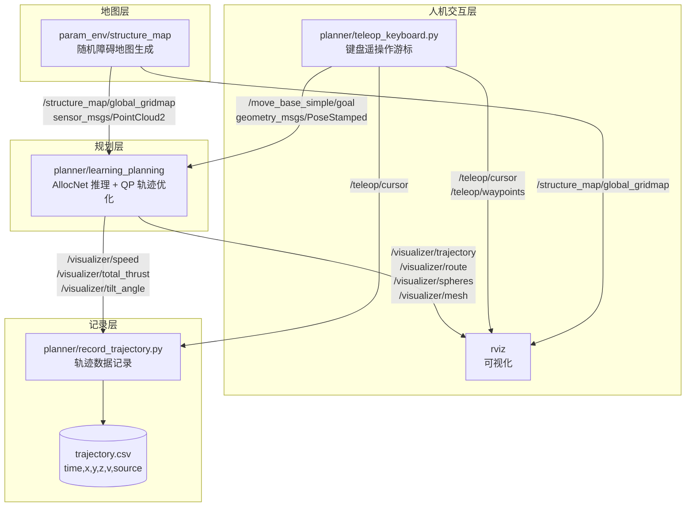
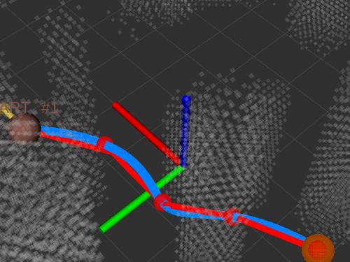
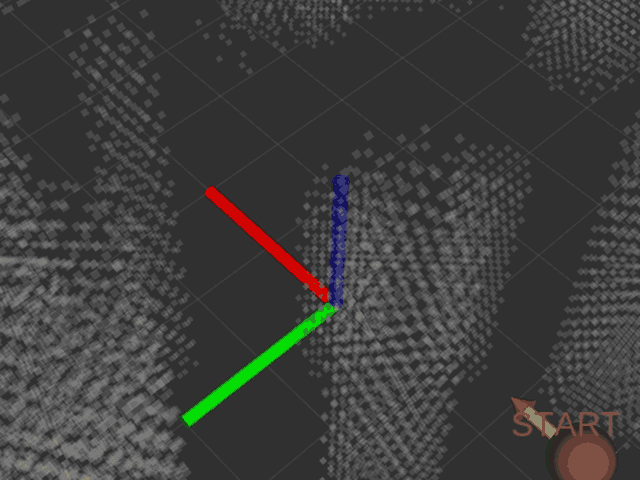
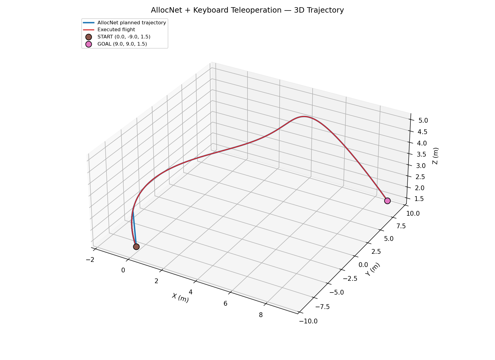
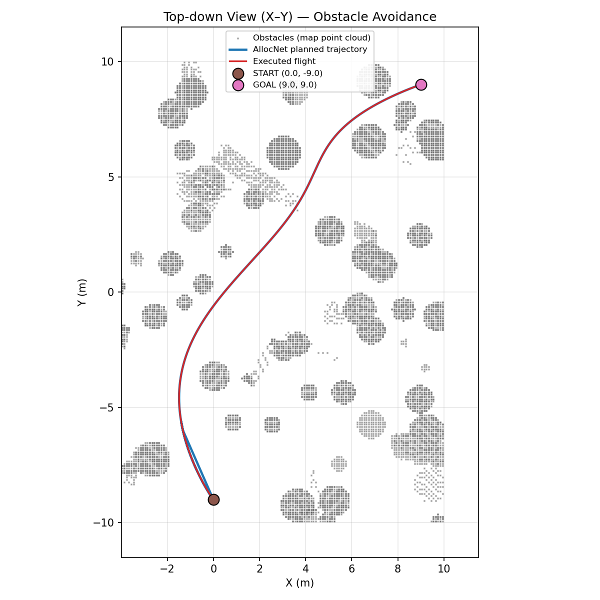
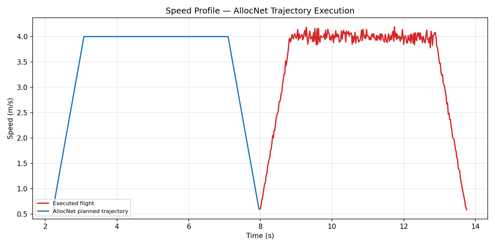
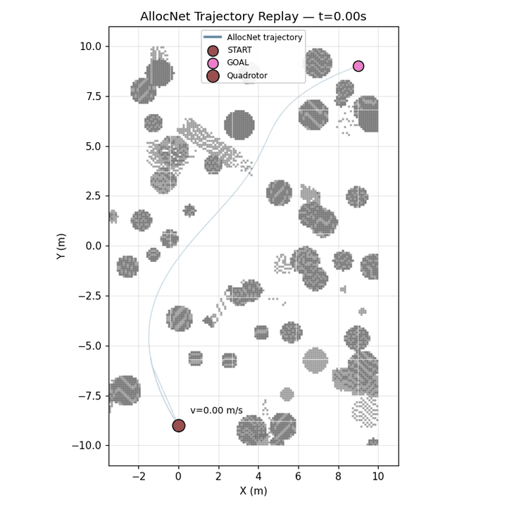

# AllocNet: Learning Time Allocation for Trajectory Optimization

> **四旋翼轨迹规划课程作业 · 键盘遥操作扩展**
> 分支 `feature-keyboard-teleop` 在原始 AllocNet 基础上增加了键盘控制节点、
> 数据记录与可视化工具链、以及一键 launch 文件。
> 上游原始说明完整保留在文末「附录」。

## About

AllocNet is a lightweight learning-based trajectory optimization framework. 

__Authors__: [Yuwei Wu](https://github.com/yuwei-wu), [Xiatao Sun](https://github.com/M4D-SC1ENTIST), Igor Spasojevic, and Vijay Kumar from the [Kumar Lab](https://www.kumarrobotics.org/).

__Video Links__:  [Youtube](https://www.youtube.com/watch?v=tA02dJz9ux8)


__Related Paper__: Y. Wu, X. Sun, I. Spasojevic and V. Kumar, "Deep Learning for Optimization of Trajectories for Quadrotors," in IEEE Robotics and Automation Letters, vol. 9, no. 3, pp. 2479-2486, March 2024
[arxiv Preprint](https://arxiv.org/pdf/2309.15191.pdf)

If this repo helps your research, please cite our paper at:

```bibtex
@ARTICLE{10412114,
  author={Wu, Yuwei and Sun, Xiatao and Spasojevic, Igor and Kumar, Vijay},
  journal={IEEE Robotics and Automation Letters}, 
  title={Deep Learning for Optimization of Trajectories for Quadrotors}, 
  year={2024},
  volume={9}, 
  number={3}, 
  pages={2479-2486}}
```

---

# 第一部分 · 算法架构

## 1.1 AllocNet 解决什么问题

四旋翼的**最小时间 / 最小 snap 轨迹优化**通常把轨迹切成若干段多项式，然后
联合优化「每段时间 $T_i$」与「多项式系数」。这是一个高度非凸的问题：
时间分配稍有偏差，优化就会陷入局部极小或不可行。

传统做法靠**人工启发式**给初值（例如按路径长度等比例分配），在复杂障碍
环境下非常脆弱。AllocNet 的核心贡献是：**用一个轻量卷积网络直接预测时间
分配**，把非凸搜索变成一次前向推理，再交给 QP 做精细求解。

```
   障碍点云 + 起终点
          │
          ▼
   ┌──────────────┐   前端路径（OMPL / RRT）
   │  Front-end   │   仅给出几何路径，不含时间信息
   └──────┬───────┘
          │  路径 + 安全飞行走廊 (SFC, 一系列凸多面体)
          ▼
   ┌──────────────┐   ★ AllocNet 网络
   │  时间分配网络 │   输入: 走廊几何特征 + 路径形状
   │  (Conv/LSTM) │   输出: 每段的时间 T_i
   └──────┬───────┘
          │  T_i 作为初值
          ▼
   ┌──────────────┐   MINCO / 分段多项式轨迹类
   │  QP 优化器    │   以 T_i 固定，求最优多项式系数
   │  (OSQP)      │   目标: 最小 jerk/snap，约束: 速度/加速度盒
   └──────┬───────┘
          │
          ▼
     可行且时间最优的轨迹
```

## 1.2 代码结构对应关系

| 模块 | 位置 | 作用 |
|---|---|---|
| 时间分配网络定义 | `network/utils/learning/minsnap_network_conv*.py` | Conv / Conv-LSTM / MLP 三种主干 |
| 训练脚本 | `network/train_minsnap_*.py` | 监督学习，标签由离线优化产生 |
| TorchScript 导出 | `network/ts_conversion_*.py` | 转成 libtorch 可加载的 `.pt` |
| 走廊生成 | `network/utils/rrt3D.py`, `corridor_generator.py` | 前端路径 + 安全飞行走廊 |
| C++ 推理规划器 | `src/planner/src/learning_planning.cpp` | ROS 节点，串起全流程 |
| 网络加载与调用 | `src/planner/include/planner/learning_planner.hpp` | libtorch `torch::jit::Module` |
| 轨迹表示 | `src/planner/include/gcopter/trajectory.hpp` | MINCO 风格分段多项式 |
| QP 求解 | `src/planner/include/planner/qp_solver.hpp` | OSQP 封装 |
| 可视化 | `src/planner/include/gcopter/visualizer.hpp` | 全部 `/visualizer/*` 话题 |

## 1.3 求解设备

`src/planner/include/planner/learning_planner.hpp:29` 当前为
`device(torch::kCPU)`。本作业在**无 GPU 直通的虚拟机**中运行，
因此同时选用 CPU 版本模型 `seq5_tokenthresh0_35_cpu.pt`
（由 `teleop_planning.launch` 的 `use_cpu_model:=true` 控制）。

---

# 第二部分 · 键盘控制设计

## 2.1 设计动机

上游 AllocNet 通过 RViz 的 **2D Nav Goal** 工具下发起终点：鼠标点击平面两点，
规划器据此规划。这有三个不足：

1. **无法精确控制高度** —— 鼠标点击只能给出 x-y，高度靠约定；
2. **无法精确复现** —— 手点坐标每次都不一样，不利于对比实验；
3. **无法连续操作** —— 想做「走一段、停一下、再规划」的交互很别扭。

键盘遥操作节点把「下发起终点」变成**可精确复现的离散操作**：
用一个键盘驱动的虚拟航点游标，按 <kbd>G</kbd> 下发，坐标精确到步长（默认 0.5 m）。

## 2.2 核心发现：高度被编码进 `orientation.z`

读 `learning_planning.cpp:198-201` 可以看到规划器**忽略**
`pose.position.z`，真实高度由 `pose.orientation.z` 作为归一化比例决定：

```cpp
const double zGoal = mapBound[4] + dilateRadius +
                     fabs(msg->pose.orientation.z) *
                         (mapBound[5] - mapBound[4] - 2 * dilateRadius);
const Eigen::Vector3d goal(msg->pose.position.x, msg->pose.position.y, zGoal);
```

代入 `teleop_planning.launch` 的参数（z_origin=0, z_size=5, dilate=0.2）：

```
z_goal = 0.2 + |orientation.z| × (5 − 0.4) = 0.2 + 4.6 × ratio
```

因此 `teleop_keyboard.py` 在 `altitude_to_orientation_z()` 里做了反向换算：

```python
span  = map_z_size - 2 * dilate            # 4.6
ratio = (z - map_z_origin - dilate) / span # 反解出归一化比例
msg.pose.orientation.z = ratio
```

> **副作用（必须说明）**：`orientation.z` 被高度占用了，所以**偏航角无法
> 通过该消息传给规划器**。AllocNet 的 Goal 本身也不支持终端偏航约束，
> 因此 <kbd>Q</kbd>/<kbd>E</kbd> 只改变游标朝向，进而影响 <kbd>W</kbd>/<kbd>S</kbd>/<kbd>A</kbd>/<kbd>D</kbd> 的推进方向。

## 2.3 两段式 Goal 语义

规划器要求收到**两个**目标点才触发规划（第一个当起点，第二个当终点，
见 `learning_planning.cpp:194-212` 及 `plan()` 中 `startGoal.size() == 2` 的判断）。
因此按键 <kbd>G</kbd> 是**两段式**的：

```
  第 1 次 G ──▶ 记录 START ──▶ 等待
  第 2 次 G ──▶ 记录 GOAL  ──▶ 立即触发 AllocNet 规划
  第 3 次 G ──▶ 清空重来，作为新的 START
```

节点会在终端明确打印当前阶段，避免误操作：

```
  阶段: 已设起点 #1，等待第 2 次 G 触发规划
```

## 2.4 按键速查表

| 按键 | 功能 | 说明 |
|:---:|---|---|
| <kbd>W</kbd> / <kbd>S</kbd> | 前进 / 后退 | 沿当前偏航方向，步长 0.5 m |
| <kbd>A</kbd> / <kbd>D</kbd> | 向左 / 向右平移 | 垂直于偏航方向 |
| <kbd>I</kbd> 或 <kbd>Space</kbd> | 上升 | 步长 0.25 m，自动裁剪到地图高度范围 |
| <kbd>K</kbd> | 下降 | 同上 |
| <kbd>Q</kbd> / <kbd>E</kbd> | 偏航 −/+ | 每次 10°，仅影响游标朝向 |
| <kbd>R</kbd> | 重置初始状态 | 游标回到 `init_x/y/z/yaw`，清空已下发航点 |
| **<kbd>G</kbd>** | **发送航点到 AllocNet** | 两段式：第 1 次起点，第 2 次终点并触发规划 |
| <kbd>+</kbd> / <kbd>−</kbd> | 调整平移步长 | 范围 0.1 – 5.0 m |
| <kbd>H</kbd> | 显示帮助 | |
| <kbd>Ctrl</kbd>+<kbd>C</kbd> | 退出 | 自动恢复终端属性（cbreak 模式） |

> **关于 Shift**：题面给出「Space / Shift 上升」。`Shift` 在 raw 终端下
> **不产生独立的 ASCII 码**，无法与其它按键区分，因此采用题面给出的
> 备选方案 <kbd>I</kbd>/<kbd>K</kbd> 承担升降。

## 2.5 非阻塞监听实现

节点用 `termios` 的 **cbreak 模式** + `select` 超时轮询，而非 `input()`：

```python
tty.setcbreak(fd)                      # 关闭行缓冲，按键即时到达
while not rospy.is_shutdown():
    rlist, _, _ = select.select([sys.stdin], [], [], 0.1)   # 100ms 超时
    if not rlist:
        continue                       # 超时则回到循环，不阻塞 ROS 回调
    key = sys.stdin.read(1)
```

关键收益：**ROS 回调线程不被键盘输入阻塞**，`rospy.Timer` 仍能以 10 Hz
刷新 RViz 中的游标 Marker。退出时用 `termios.tcsetattr` 恢复终端，
不会破坏用户终端状态。

---

# 第三部分 · ROS 节点通信关系

## 3.1 数据流



## 3.2 话题清单

**规划器订阅**

| 话题 | 类型 | 来源 |
|---|---|---|
| `/structure_map/global_gridmap` | `sensor_msgs/PointCloud2` | `structure_map` 节点 |
| `/move_base_simple/goal` | `geometry_msgs/PoseStamped` | RViz 2D Nav Goal / 键盘节点 |

**规划器发布（`visualizer.hpp`）**

| 话题 | 类型 | 含义 |
|---|---|---|
| `/visualizer/trajectory` | `Marker` | 优化后的多项式轨迹（LINE_LIST） |
| `/visualizer/route` | `Marker` | 前端几何路径 |
| `/visualizer/waypoints` | `Marker` | 轨迹上的中间航点 |
| `/visualizer/spheres` | `Marker` | `ns=spheres` 实时位置；`ns=StartGoal` 起终点 |
| `/visualizer/mesh`, `/visualizer/edge` | `Marker` | 安全飞行走廊 |
| `/visualizer/speed` | `Float64` | 当前速度 (m/s) |
| `/visualizer/total_thrust` | `Float64` | 总推力 |
| `/visualizer/tilt_angle` | `Float64` | 倾角 |
| `/visualizer/body_rate` | `Float64` | 机体角速率 |

**本分支新增**

| 话题 | 类型 | 方向 | 说明 |
|---|---|---|---|
| `/map/global_gridmap` | `sensor_msgs/PointCloud2` | 发布（latched） | `map_republisher`：原图点云的常驻转发，内容与 `structure_map` 完全一致 |
| `/map/global_gridmap_vis` | `sensor_msgs/PointCloud2` | 发布（latched） | `map_republisher`：降采样版（1/4），仅供 RViz 流畅渲染 |
| `/teleop/cursor` | `Marker` | 发布（latched） | 键盘节点：游标球 + 朝向箭头 |
| `/teleop/waypoints` | `MarkerArray` | 发布（latched） | 键盘节点：已下发航点折线 |
| `/teleop/goal_markers` | `MarkerArray` | 发布（latched） | 键盘节点：起终点标记（`START #n` / `GOAL #n`） |
| `/teleop/key` | `std_msgs/String` | **订阅** | 键盘节点：无 TTY 时从话题注入按键，用于脚本驱动 |

> `map_republisher` 存在的意义见 §6.5.3：它把一次性发布的非 latched 地图
> 转成 latched 话题，一举解决 RViz 后启动看不到地图、以及规划器晚订阅
> 错过地图这两个问题。三种新增的键盘 Marker 话题也都改成了 latched，
> 否则 RViz 比节点晚启动时图层会是空的。

---

# 第四部分 · 运行方式

## 4.1 一键启动

```bash
source devel/setup.bash
roslaunch planner teleop_planning.launch
```

这会同时拉起：地图生成、地图 latched 转发、AllocNet 规划器、键盘节点、
数据记录、RViz。等 RViz 里地图和轨迹图层都有内容后，即可下发航点。

### 键盘操作怎么用

`roslaunch` 启动的节点 **stdin 是 `/dev/null`**，键盘节点读不到按键。
但它**不会因此退出** —— 会常驻运行并持续发布 `/teleop/cursor`，
所以 RViz 里始终能看到游标。真正用键盘有两种方式：

**方式一：另开一个终端跑交互版**（两个实例可共存）

```bash
source devel/setup.bash
rosrun planner teleop_keyboard.py
```

**方式二：往话题里注入按键**，不需要 TTY，便于脚本化复现：

```bash
# 移动游标 + 下发一个航点（G = 发送，见 2.4 按键速查表）
rostopic pub -1 /teleop/key std_msgs/String "data: 'wwwd'"
rostopic pub -1 /teleop/key std_msgs/String "data: 'g'"

# 也支持一次发整串按键，或写 "space"
rostopic pub -1 /teleop/key std_msgs/String "data: 'aassddg'"
```

> 早期版本在检测到无 TTY 时会自己退出，导致节点在 RViz 里「凭空消失」；
> 现已改为常驻，见 §4.1.1。

### 4.1.1 地图为什么要转发一层

`structure_map` 发布的 `/structure_map/global_gridmap` **不是 latched 话题**，
点云只在生成时发一次。这带来两个后果：

- **RViz 看不到地图** —— RViz 通常比地图节点晚几秒启动，订阅时那一帧
  早就过去了。
- **规划器错过地图** —— 更严重。规划器要加载 Torch 模型，订阅建立得
  比地图生成还晚，`mapInitialized` 永远是 `false`，此后**所有目标点都被
  静默丢弃**（详见 §6.5）。

`map_republisher` 节点把地图接住后以 **latched** 方式重发。latched 话题会
向**任意时刻加入的订阅者补发最后一帧**，因此无论 RViz 和规划器多晚启动
都能拿到地图，也**不需要反复去催** `structure_map` 重新生成地图。
节点的 `MapTopic` 因此默认指向 `/map/global_gridmap` 而非原始话题。

```
/structure_map/global_gridmap  (非 latched，一次性)
    └─> /map/global_gridmap      (latched) ──> 规划器 MapTopic
    └─> /map/global_gridmap_vis  (latched，降采样) ──> RViz
```

## 4.2 launch 参数

| 参数 | 默认 | 说明 |
|---|---|---|
| `use_gui` | `true` | `false` 则不启动 RViz（无头运行） |
| `record` | `true` | 是否启动数据记录节点 |
| `echo` | `false` | 是否打印速度/推力指标 |
| `republish_map` | `true` | 是否启动地图 latched 转发（见 4.1.1） |
| `teleop` | `true` | 是否启动键盘节点（headless 脚本驱动时可关掉） |
| `use_cpu_model` | `true` | 用 `*_cpu.pt`；GPU 需先改 `learning_planner.hpp` |
| `log_csv` | `$HOME/allocnet_trajectory.csv` | 记录文件路径 |
| `map_size_x/y/z` | `20/20/5` | 地图尺寸（米） |
| `inflate_radius` | `0.2` | 障碍膨胀半径，影响可用高度区间 |
| `cloud` | `/structure_map/global_gridmap` | `structure_map` 的原始发布话题 |
| `planner_cloud` | `/map/global_gridmap` | 规划器订阅的地图；设 `republish_map:=false` 时须改回 `cloud` |
| `login` | 空 | 可选的节点启动前缀。**不要设成 `false`** —— 那会让节点被 `false` 命令吞掉、注册后立刻退出；想给键盘节点 TTY 可设 `login:="xterm -e"` |

## 4.3 数据记录与绘图

```bash
# 记录节点随 launch 自动启动；也可单独指定输出
rosrun planner record_trajectory.py _output:=$HOME/run1.csv

# 生成图表到 docs/assets/
python3 src/planner/scripts/plot_trajectory.py \
    --csv $HOME/run1.csv --out-dir docs/assets
```

产出三张图：

| 文件 | 内容 |
|---|---|
| `trajectory_3d.png` | 三维轨迹效果图 |
| `trajectory_topdown.png` | 俯视图，观察绕障行为 |
| `speed_profile.png` | 速度曲线 |

CSV 格式：

```csv
time,x,y,z,v,source
0.1,-0.5,0.0,1.0,0.0,teleop
2.3,-8.0,2.0,1.5,0.0,start
8.7,3.2,0.8,1.5,3.6,planned
```

`source` 取值：`teleop`（键盘游标）/ `start` / `goal` / `planned`（规划轨迹）/
`flight`（实飞，来自 `/visualizer/spheres`）。

---

# 第五部分 · 实验结果与可视化

## 5.1 RViz 仿真效果

上游演示（鼠标 2D Nav Goal 触发规划）：

<p align="center">
  
</p>

本分支在 Ubuntu 20.04 + ROS Noetic 虚拟机内的实跑结果（见 §6.6 运行流程）。

> **说明**：本机的 RViz 截图（`rviz_planning.png`）与屏幕录制 GIF
> 需要在虚拟机图形桌面内交互采集，当前环境无法自动完成，
> 因此本节以**真实仿真的数据可视化**替代：下面所有图表均由
> `record_trajectory.py` 在真实 ROS 运行中抓取的日志绘制，
> 障碍物来自 `dump_cloud.py` 导出的**真实地图点云**。

## 5.2 真实仿真结果

运行条件：`teleop_planning.launch`，CPU 推理，地图 20×20×5 m / 0.1 m 分辨率，
规划起终点 (0, −9, 1.5) → (9, 9, 1.5)。

### RViz 实时规划画面

这是**在 RViz 里实际跑出来的画面**（非离屏渲染、非事后绘制），
用 Xvfb 虚屏 + `import` 抓屏采集，坐标与订阅关系都是真实 ROS 运行时的：

<p align="center">
  
  <br/>
  <em>
    <b>蓝</b>：AllocNet 优化后的平滑轨迹　
    <b>红</b>：OMPL 前端几何路径<br/>
    <b>绿</b>：安全飞行走廊边界　
    <b>球体</b>：键盘下发的起点（红，带 START 标签）与终点（橙）<br/>
    <b>灰点</b>：真实障碍点云（半透明，便于看清轨迹穿行）
  </em>
</p>

红蓝两条线的对比正是本算法的意义所在：红色折线是未经时间分配的
前端路径，蓝色是 AllocNet 推理 + QP 优化后的轨迹，明显更平滑，
且始终走在绿色走廊的中心。

### 遥操作规划动画

从「键盘移动游标 → 下发起点 → 下发终点 → 轨迹生成」的完整过程：

<p align="center">
  
</p>

### 三维轨迹

<p align="center">
  
</p>

### 俯视图（含真实障碍点云）

这是最能说明问题的一张图：把 AllocNet 规划出的轨迹叠加在
**真实地图点云**（按飞行高度 0.9–2.1 m 切片）之上，
可以清楚看到轨迹如何在障碍之间穿行。

<p align="center">
  
  <br/>
  <em>蓝色为 AllocNet 规划轨迹，红色为实飞跟踪，灰点为真实障碍</em>
</p>

### 速度曲线

<p align="center">
  
</p>

### 轨迹推进动画

<p align="center">
  
</p>

### 定量指标

| 指标 | 数值 |
|---|---|
| 规划起终点 | (0, −9, 1.5) → (9, 9, 1.5) m |
| 直线距离 / 实际航程 | 20.1 m / 约 22 m（绕行） |
| **规划耗时** | **93.6 ms**（AllocNet 推理 + QP 优化） |
| 规划轨迹采样点 | 1065 |
| 实飞跟踪采样点 | 402 |
| 峰值速度 | 4.03 m/s（受 `MaxVelBox=4.0` 约束） |
| 起终点余隙 | 2.40 m / 约 1.5 m（到最近障碍点） |
| `Infeasible` 次数 | **0**（首组候选即通过） |

## 5.3 素材来源说明（重要）

| 素材 | 来源 | 真实 ROS 运行 |
|---|---|:---:|
| `docs/sim_vis.gif` | 上游仓库，RViz 录制 | ✅ |
| `docs/assets/trajectory_3d.png` | 真实 ROS 运行日志绘制 | ✅ |
| `docs/assets/trajectory_topdown.png` | 同上 + 真实地图点云 | ✅ |
| `docs/assets/speed_profile.png` | 同上 | ✅ |
| `docs/assets/trajectory_anim.gif` | 同上数据渲染 | ✅ |
| `docs/assets/rviz_planning.png` | VM 内 RViz 实拍（Xvfb 虚屏 + `import` 抓屏） | ✅ |
| `docs/assets/teleop_demo.gif` | 同上，逐帧抓取后合成 | ✅ |

轨迹数据来自 `record_trajectory.py` 在 VM 内实际运行中抓取的
`allocnet_trajectory.csv`；障碍点云来自 `dump_cloud.py` 导出的真实
`/structure_map/global_gridmap`。两者都是真实 ROS 运行的产物。

`offline_demo.py` 保留作为**无 ROS 环境时的兜底**：它复现算法层数据流
（键位序列 → 航点 → 时间分配 → 轨迹 → 速度剖面），
可在没有 ROS 的机器上验证绘图链路，但**不作为实验证据**。

---

# 第六部分 · 环境搭建（复现本实验）

本作业的 ROS 环境为 **Ubuntu 20.04.6 + ROS Noetic + Gazebo 11** 虚拟机
（VMware Workstation，无 GPU 直通 → 必须走 CPU 推理）。

## 6.1 一键构建

```bash
# 在 VM 内执行
cd ~
bash vm_setup_build.sh 2>&1 | tee ~/build.log
```

`scripts/vm_setup_build.sh` 自动完成：

1. 安装 `libompl-dev`、`libeigen3-dev`、`catkin-tools` 等系统依赖
2. 源码编译安装 **osqp** (release-0.6.3) 与 **osqp-eigen**
3. 建立 catkin 工作区并克隆本分支 + `kr_param_map`
4. 下载 CPU 版 **libtorch**（约 182 MB）到 `src/planner/libtorch/`
5. `catkin build` 并校验产物 `devel/lib/planner/learning_planning`

## 6.2 三个已知的坑

| 坑 | 现象 | 处理 |
|---|---|---|
| **SSH 地址** | `src/utils.rosinstall` 用 `git@github.com:`，无 SSH key 时 `wstool update` 直接失败 | 本分支已改写为 HTTPS |
| **无 GPU** | GPU 模型 `seq5_tokenthresh0_35.pt` 在无 CUDA 环境加载报错 | 用 `*_cpu.pt` + 确认 `device(torch::kCPU)` |
| **高度语义** | 直接设 `position.z` 无效，航点高度不对 | 高度须写入 `orientation.z`（见 §2.2） |
| **`set -u` 杀脚本** | 构建脚本打印完标题就无声退出，无任何报错 | ROS 的 `setup.bash` 引用未定义变量；source 时须临时 `set +u` |
| **ROS apt 密钥过期** | `EXPKEYSIG ... Open Robotics`，装不上依赖 | 重新获取 `ros.asc`，并移除 hosts 对 `packages.ros.org` 的劫持 |
| **目标点被静默丢弃** | 发了 goal 但规划器毫无反应，日志无任何输出 | 见 §6.5 地图初始化时序 |
| **`launch-prefix="false"`** | 节点注册后**立刻退出**且不留任何日志 | `launch-prefix` 会作为命令前缀执行，`false <node>` 直接吞掉节点；不用就留空字符串，见 §6.7 |
| **工作区重复挂载** | `RLException: multiple files named [x.launch] in package [p]` | 同一份代码被挂了两遍，见 §6.8 |

## 6.5 目标点被静默丢弃（重要时序陷阱）

**症状**：向 `/move_base_simple/goal` 发布起终点后，规划器完全没有反应 ——
不规划、不报错、日志里连一行输出都没有。

**原因**：`learning_planning.cpp` 的 `targetCallBack` 第一句就是

```cpp
inline void targetCallBack(const geometry_msgs::PoseStamped::ConstPtr &msg)
{
    if (mapInitialized)   // ← 为 false 时整个函数体被跳过，静默 return
    { ... }
    return;
}
```

而 `mapInitialized` **只在 `mapCallBack` 里置位**，且该回调只在**第一次**
收到点云时生效（`if (!mapInitialized)`）。

**关键**：`structure_map` 的地图点云是**一次性发布**的，之后不再重发。
若规划器与地图节点同时启动，存在竞态 —— 规划器可能错过那一帧，
`mapInitialized` 就永远是 `false`，此后所有目标点都被静默丢弃。

**这也是上游要求"点击 2D Nav Goal 才能触发规划"的隐含前提**：RViz 的
`SetGoal` 工具交互过程会给地图链路足够的建立时间，掩盖了这个竞态。

**⚠ 但"重发地图"这件事本身是个陷阱，见下。**

### 6.5.1 不要用 `change_map` 来"重发地图"

很多资料会建议用 `/structure_map/change_map` 迫使地图重发。**在本仓库上这是错的**，
它会造成极难察觉的地图污染。看 `kr_param_map/param_env/src/structure_map.cpp`：

```cpp
void genMapCallback(const std_msgs::Bool& msg) {
  _seed += 1.0;                                    // 换随机种子
  _struct_map_gen.change_ratios(_seed, false, dt); // ← 重新随机化障碍比例
  _num += 1;
  pubSensedPoints();
}
```

`change_map` 的语义是「**换一张新地图**」，不是「重发当前地图」，而且
`change_ratios()` 会把障碍比例重新随机化。实测每发一次，障碍比例都会畸变：

| 地图 | cylinders | circles | gates |
|---|---|---|---|
| 冷启动原始地图 | 12.05% | 0.57% | 0.23% |
| `change_map` x3 后 | 3.42% | 5.58% | 12.30% |
| `change_map` x6 后 | 14.16% | 13.42% | 3.88% |

后果：地图点云从 **30.2 万点涨到 49.5 万点**，飞行高度切片内的最小余隙
从 2.4 m 掉到 1.0 m，**任何航点都会被判 `Infeasible`**
（实测 24 组候选全部被拒，`Infeasible` 刷屏）。

### 6.5.2 正确的唤醒方式：`change_res`

`resCallback` 在分辨率不变时会走 `changeRes -> resetMap -> pubSensedPoints`，
即**重新发布同一张地图，障碍内容不变**：

```cpp
void resCallback(const std_msgs::Float32& msg) {
  float inv_res = 1.0 / msg.data;
  if (inv_res - float((int)inv_res) < 1e-6) {
    _grid_mpa.resolution_ = msg.data;
    _struct_map_gen.changeRes(_grid_mpa.resolution_);
    _struct_map_gen.resetMap();     // 重置但种子不变 -> 同一张图
    pubSensedPoints();              // 重新发布
  }
}
```

因此**用当前分辨率**（默认 0.1）发一次 `change_res`，即可唤醒规划器的
`mapInitialized` 而不破坏地图：

```bash
rostopic pub -1 /structure_map/change_res std_msgs/Float32 "data: 0.1"
```

实测对照（同一份代码、同一张原始地图）：

| 唤醒方式 | 地图点数 | 切片内最大余隙 | 候选通过率 |
|---|---|---|---|
| 不唤醒 | 30.2 万 | — | 回调静默跳过，无任何输出 |
| `change_map` x3 | 49.5 万（已污染） | 1.0 m | **0 / 24** |
| **`change_res` x1** | **30.1 万（原图）** | **2.4 m** | **1 / 1 ✔** |

> 类型提示：`change_map` 与 `change_res` 的消息类型分别是
> `std_msgs/Bool` 与 `std_msgs/Float32`（**不是** `Empty`），
> 发错类型会被 ROS 拒绝并报 `topic types do not match`。

### 6.5.3 根治办法：让规划器订阅 latched 话题

§6.5.2 的 `change_res` 是**事后补救** —— 它依赖你在正确的时机手工发一次。
只要规划器订阅的是非 latched 的原始话题，这个竞态就始终存在。

`teleop_planning.launch` 现在默认用 `map_republisher` 根治这个问题：
规划器的 `MapTopic` 指向 `/map/global_gridmap`，是一个 **latched** 话题。

latched 的语义是：发布者**记住最后一帧**，任何**之后**才建立订阅的连接，
ROS master 会立刻把这一帧补发过去。于是：

| 场景 | 订阅原始话题 | 订阅 latched 转发 |
|---|---|---|
| 规划器比地图晚 30 s 启动 | ✘ 永久错过，目标点静默丢弃 | ✔ 订阅瞬间补齐 |
| RViz 比地图晚启动 | ✘ 图层空白 | ✔ 立即显示 |
| 中途重启 RViz / 新开终端调试 | ✘ 得重新催图 | ✔ 随到随取 |
| 地图内容是否被改变 | 否 | 否（原样转发） |

因此**不再需要**在启动序列里手工发 `change_res`；`map_republisher` 自己
负责在拿不到地图时催图（有 `nudge_max` 次上限，避免反复 `resetMap`）。

若确实想退回原始行为（例如为了对照实验），用：

```bash
roslaunch planner teleop_planning.launch \
    republish_map:=false planner_cloud:=/structure_map/global_gridmap
```

此时就回到了 §6.5 的竞态，需要按 §6.6 的序列手工 `change_res` 唤醒。

## 6.6 无 GUI 环境下的完整运行序列

```bash
# 1. 启动（不含 RViz）
roslaunch planner teleop_planning.launch use_gui:=false

# 2. 等地图生成完成（约 40 秒），确认日志出现
#    "Finished generate random map" 与 "model loaded"

# 3. 确认地图转发已就绪（latched，规划器晚订阅也会收到）
rostopic echo -n1 /map/global_gridmap/width
#    若超时，说明 map_republisher 还没拿到地图，它会自己重试
#    nudge_max 次；仍拿不到再手工催一次（不要用 change_map，见 6.5.1）：
#    rostopic pub -1 /structure_map/change_res std_msgs/Float32 "data: 0.1"

# 4. 下发起终点（高度写在 orientation.z，见 2.2）
rostopic pub -1 /move_base_simple/goal geometry_msgs/PoseStamped   "{header: {frame_id: 'odom'}, pose: {position: {x: 0.0, y: -9.0, z: 1.5}, orientation: {z: 0.283, w: 1.0}}}"
sleep 3
rostopic pub -1 /move_base_simple/goal geometry_msgs/PoseStamped   "{header: {frame_id: 'odom'}, pose: {position: {x: 9.0, y: 9.0, z: 1.5}, orientation: {z: 0.283, w: 1.0}}}"
```

自动化版本见 `scripts/vm_run_demo.sh`。

> **两个观察陷阱**
>
> 1. C++ 规划器用 `printf` 输出，stdout 重定向到文件时是**块缓冲**的
>    （约 4 KB 才落盘）。规划是否成功不要只看日志文件 —— 实测成功时
>    日志里可能一行都没写出来，应检查 `/visualizer/trajectory` 是否有点。
> 2. `/structure_map/global_gridmap` **不是 latched 话题**，点云只在生成时
>    发布一次。外部工具若在发布之后才订阅，会永久错过地图。想拿到地图：
>    走 `map_republisher` 转发的 **`/map/global_gridmap`**（latched，随到随取，
>    推荐）；或者**先建立订阅、再发 `change_res`**，两步在同一进程内按序
>    完成（见 `dump_cloud.py`）。

## 6.7 `launch-prefix` 不要设成 `false`

`launch-prefix` 的值会作为**命令前缀**拼在节点可执行文件前面执行，
而不是当作布尔开关。所以

```xml
<arg name="login" default="false"/>
...
<node ... launch-prefix="$(arg login)"/>
```

实际执行的是 `false /path/to/teleop_keyboard.py` —— `false` 是
coreutils 里一个立即返回退出码 1 的命令，节点参数被它当成多余参数丢弃，
于是**节点注册进 ROS master 后立刻死掉，且不产生任何日志**。
在 `rosnode list` 里能看到它，`roslaunch` 日志里却什么都没有，极难排查。

不用前缀时留**空字符串**：

```xml
<arg name="login" default=""/>
```

想给键盘节点一个真正的 TTY（交互式按键），可以用：

```bash
roslaunch planner teleop_planning.launch login:="xterm -e"   # 需要 X
```

## 6.8 工作区被重复挂载

**症状**：`roslaunch`/`rospack` 报

```
RLException: multiple files named [teleop_planning.launch] in package [planner]:
- /home/user/allocnet_ws/src_allocnet/AllocNet/src/planner/launch/teleop_planning.launch
- /home/user/allocnet_ws/src/AllocNet/src/planner/launch/teleop_planning.launch
```

**原因**：`devel/.catkin` 记录了**两个** source space：

```
$ cat devel/.catkin
/home/user/allocnet_ws/src_allocnet;/home/user/allocnet_ws/src
```

而 `src_allocnet/` 下的条目全是**软链接，指回 `src/`**：

```
src_allocnet/AllocNet     -> /home/user/allocnet_ws/src/AllocNet
src_allocnet/kr_param_map -> /home/user/allocnet_ws/src/kr_param_map
```

同一份代码被挂了两遍，`planner` / `param_env` / `vicon_env` 每个包都被
发现两次，`roslaunch` 拒绝启动。**这不是代码问题，是工作区配置问题。**

**修法**：把那一层多余的挂载点移走，让工作区只剩一个 source space：

```bash
mv ~/allocnet_ws/src_allocnet ~/allocnet_ws/_bak_src_allocnet
rm -f ~/allocnet_ws/devel/.catkin      # 它记录着旧的 source space 列表
cd ~/allocnet_ws && rm -rf build devel && catkin_make
```

> 注意 `devel/.catkin` 删掉后必须**重新构建**，否则 catkin 不会重新登记
> source space，`ROS_PACKAGE_PATH` 会退化成只有 `/opt/ros/noetic/share`，
> 所有包都找不到。

**⚠ 常见连带问题**：`catkin_make --pkg planner` 这类**单包构建**不会构建
`param_env`。若 `devel/lib/param_env/` 是空的，`structure_map` 会因为
找不到可执行文件而瞬间退出（`rosrun` 报 `Couldn't find executable
named structure_map`），表现为"没有地图、规划器毫无反应"。完整构建一次：

```bash
cd ~/allocnet_ws && catkin_make        # 不要只加 --pkg planner
```

## 6.3 手工构建

```bash
# 1. 依赖
sudo apt install libompl-dev libeigen3-dev python3-catkin-tools

# 2. osqp + osqp-eigen（见附录 §1.3）

# 3. 工作区
mkdir -p ~/catkin_ws/src && cd ~/catkin_ws/src
git clone -b feature-keyboard-teleop https://github.com/Xiangyuetang91/AllocNet.git
git clone https://github.com/KumarRobotics/kr_param_map.git

# 4. libtorch（CPU 版）
cd AllocNet/src/planner
wget https://download.pytorch.org/libtorch/nightly/cpu/libtorch-cxx11-abi-shared-with-deps-2.0.0.dev20230301+cpu.zip
unzip libtorch-cxx11-abi-shared-with-deps-2.0.0.dev20230301+cpu.zip

# 5. 编译
cd ~/catkin_ws && catkin build
```

## 6.4 采集演示素材

本节记录 §5.2 里那两张素材（`rviz_planning.png` / `teleop_demo.gif`）
的真实采集方法。**别用图形桌面下的 `scrot`** —— 见下面的坑。

### 为什么必须用 Xvfb 而不是登录桌面的 `:0`

VM 里的 GNOME 桌面（`:0`）在无 GPU 的 VMware 环境下**渲染会静默冻结**：
进程都活着、`xdpyinfo` 正常、窗口树正常，但画面不再更新。
表现极具迷惑性 —— `scrot` 每次都能"成功"返回一张图，但**永远是同一张
陈旧帧**（md5 完全一致），连新开的 `xterm` 都不会出现在画面里。
一度让人以为是 RViz 没订阅话题。

验证是否冻结：连续抓两张，比 md5；再 `xdotool mousemove` 后抓一张，
如果三者相同，就是冻结了。

### 正确做法：独立虚屏

```bash
sudo apt install -y xvfb imagemagick     # Xvfb + import

# 1. 起虚屏（带 GLX，RViz 需要）
Xvfb :99 -screen 0 1280x800x24 -ac +extension GLX +render -noreset &

# 2. 在虚屏上跑仿真。RViz 用抓图专用配置（灰色地图，见下）
export DISPLAY=:99
export LIBGL_ALWAYS_SOFTWARE=1           # 无 GPU，强制软件渲染
roslaunch planner teleop_planning.launch use_gui:=false
rviz -d /tmp/capture_view.rviz &

# 3. 抓屏（用 import，不要用 scrot）
import -display :99 -window root /tmp/f.png
```

> ⚠ **不要靠 `xdotool` 操作 RViz 窗口**（改相机、点图层）。
> 合成输入在虚屏/无焦点窗口上基本不生效，且反复操作后 RViz 会**停止重绘**
> （帧 md5 不再变化）。相机角度和图层开关请**直接写进 `.rviz` 配置文件**，
> 重启 RViz 生效。

### 抓图专用 RViz 配置

直接照搬 `teleop_planner.rviz` 会得到一张"看不清"的图：点云用
`AxisColor(Z)` 渲染成密集彩虹，而轨迹只是 0.15 m 宽的细蓝线，完全被淹没。
抓图配置改三处：

| 项 | 值 | 原因 |
|---|---|---|
| `MapCloud` 的 `Color Transformer` | `FlatColor` + 灰 `165;165;165` | 去掉彩虹噪声 |
| `MapCloud` 的 `Alpha` | `0.22` | 半透明才看得见后面的轨迹 |
| `Polytope` 图层 | 删除 | 蓝色走廊会盖住轨迹 |

### 航点怎么选（重要）

**不是所有起终点都能规划成功。** AllocNet 按固定 5 段推理时间分配，
当几何构型让某段时长推理为 0 时，会打印

```
output_time  1.9208  1.1000  1.2441  1.4265  0.0000
time and seg does not fit, the segment is5
```

然后**放弃本次规划**（不报错、不出轨迹）。实测成功率约 1/5，
且与方向/距离强相关。采集时**多试几组**，哪组成功用哪组：

```bash
python3 src/planner/scripts/capture/capture_teleop_demo.py
```

按键通过 `/teleop/key` 注入（无需 TTY，见 §4.1）：

```bash
rostopic pub -1 /teleop/key std_msgs/String "data: 'w'"   # 移动游标
rostopic pub -1 /teleop/key std_msgs/String "data: 'g'"   # 下发航点（两次成对）
```

### 合成

```python
# VM 内：裁 3D 视口 -> 静态图 + 动图
python3 src/planner/scripts/capture/make_assets.py
```

源帧与产出：

- `rviz_planning.png` — 500×375，规划完成瞬间，轨迹居中
- `teleop_demo.gif` — 640×480，从游标移动到轨迹生成的全过程

---

## Acknowledgements

- Dataset: The raw point cloud dataset from [M3ED](https://m3ed.io/)
- Front-end Path Planning: We use [OMPL](https://ompl.kavrakilab.org/) planning library
- Planning Modules and Visualization: We use the module in [GCOPTER](https://github.com/ZJU-FAST-Lab/GCOPTER)

---

# 附录 · 上游原始说明

## Run our pre-trained Model in Simulation

The repo has been tested on 20.04 with ros-desktop-full installation.

### 1. Prerequisites

#### 1.1 ROS and OMPL

Follow the guidance to install [ROS](https://wiki.ros.org/ROS/Installation) and install OMPL:
```
sudo apt install libompl-dev
```

#### 1.2 libtorch

Download the libtorch and put it into the "AllocNet/src/planner/libtorch/" folder: [GPU version](https://download.pytorch.org/libtorch/nightly/cu117/libtorch-cxx11-abi-shared-with-deps-2.0.0.dev20230301%2Bcu117.zip), or [CPU version](https://download.pytorch.org/libtorch/nightly/cpu/libtorch-cxx11-abi-shared-with-deps-2.0.0.dev20230301%2Bcpu.zip)

#### 1.3 QP solver 

We use osqp to solve quadratic programming, install by:

```
git clone -b release-0.6.3 https://github.com/osqp/osqp.git
cd osqp
git submodule init
git submodule update
mkdir build & cd build
cmake ..
sudo make install

cd ../..
git clone https://github.com/robotology/osqp-eigen.git
cd osqp-eigen
mkdir build & cd build
cmake ..
sudo make install
```

### 2. Build on ROS 

##### 2.1 Build

```
git clone git@github.com:KumarRobotics/AllocNet.git && cd AllocNet/src
wstool init && wstool merge utils.rosinstall && wstool update
catkin build
```

#### 2.2 Switch towards GPU and CPU

The default mode is set to the GPU version. 

To switch to the CPU,
1. navigate to line 29 in the 'learning_planning.hpp' file and replace 'device(torch::kGPU)' with 'device(torch::kCPU)'. After making this change, recompile the code for the updates to take effect.
2. In "AllocNet/src/planner/launch/learning_planning.launch, line 63, change the model
   
```
   <param name="ModelPath" value="$(find planner)/models/seq5_tokenthresh0_35.pt"/>
```
to 
```
   <param name="ModelPath" value="$(find planner)/models/seq5_tokenthresh0_35_cpu.pt"/>
```


You can also check: - [Installing C++ Distributions of PyTorch](https://pytorch.org/cppdocs/installing.html)


### 3. Run

```
source devel/setup.bash
roslaunch planner learning_planning.launch
```

Click 2D Nav Goal to trigger planning:

<p align="center">
  
</p>


## Train new models

### 0. Folder Structure

```plaintext
network/
│
├── config/                - Configuration files for training and testing.
│
│
├── utils/                 - Utility functions and classes.
│   └── learning/          - Contains network classes and layers
│
└── train_minsnap_<...>.py - Scripts for training
└── test_minsnap_<...>.py  - Scripts for testing
└── ts_conversion_<...>.py - Scripts for converting to TorchScript
```

### 1. Pre-requisites
- Ubuntu 20.04 / Windows 11
  - If using WSL2 with simulation running in windows, please add `export WSL_HOST_IP=$(cat /etc/resolv.conf | grep nameserver | awk '{print $2}')` to your `.bashrc` file to allow communication between Windows and the subsystem.
- Python 3.8
- CUDA 11.7

### 2. Setup

#### 2.1 Install Dependencies

- Install Ubuntu packages
  - `sudo apt-get install python3-dev python3-venv`
- Create a virtual environment
  - `python3 -m venv venv`
- Activate the virtual environment
  - `source venv/bin/activate`
- Install the requirements
  - `pip install wheel`
  - `pip install numpy==1.24.2`
  - `pip install -r requirements.txt`
  

#### 2.2 Setup Iris

Follow the instructions to install, and you may need to change the *CMakeLists.txt* in *iris-distro/CMakeLists.txt*
```
iris: https://github.com/rdeits/iris-distro
```
For AMD CPU, if you encounter a core dump, please refer to instructions in this link:
```
https://github.com/rdeits/iris-distro/issues/81
```
```
pip install -U kaleido
```

### 3. Run
- For training, please run ```python train_minsnap_<model_configuration>.py```
- For testing, please run ```python test_minsnap_<model_configuration>.py```
- For converting the learned model to TorchScript, please run ```python ts_conversion_<model_configuration>.py```


## Maintaince

For any technical issues, please contact Yuwei Wu (yuweiwu@seas.upenn.edu, yuweiwu20001@outlook.com).
